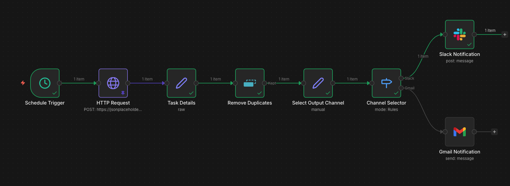

# Real-Time Transaction Alert System
### Automated monitoring · Multi-channel delivery · 24/7 operation


---

## Overview

A production-deployed automation system that monitors a live data source on a continuous schedule and delivers structured, real-time alerts to a distributed stakeholder group — replacing a manual monitoring process that was inconsistent and delay-prone.

The system runs 24/7 without intervention, deduplicates records across runs, and routes each notification to the appropriate communication channel based on configurable rules.

---

## Business Context

The client and their team were manually checking for updates across a shared platform. There was no centralized alerting mechanism, which meant time-sensitive information was often delayed or missed entirely — particularly across different time zones.

**The solution:**
- Eliminated manual monitoring entirely
- Delivered structured per-event notifications in real time
- Routed alerts to the stakeholders' existing communication platforms
- Built with retry logic and deduplication for reliable production operation

---

## Architecture

```
Schedule Trigger
      │
      ▼
 HTTP Request
 (Data Source)                                               
      │                                              
      ▼                                                
 Backend Process
 (Python · Flask · Playwright)
      │
      ▼
  Structured Data (JSON)
      │
      ▼
 Remove Duplicates
 (stateful · cross-run deduplication)
      │
      ▼
  Set Channel
  (configurable routing rules)
      │
      ▼
 Route by Channel
 (Switch node)
      │
   ┌──┴──┐
   ▼     ▼
 Slack  Gmail
```

---

## Workflow



The n8n workflow handles the full processing and delivery pipeline:

1. **Schedule Trigger** — executes the workflow on a defined interval
2. **HTTP Request** — calls the backend API to initiate the data extraction process
3. **Remove Duplicates** — stateful deduplication node that tracks records across all previous executions, ensuring each event is delivered exactly once
4. **Set Channel** — assigns the target notification channel; configurable per deployment or per record based on any field in the data
5. **Route by Channel** — Switch node that directs each record to the correct output node
6. **Slack / Gmail** — delivers a structured, per-event notification to the stakeholder's platform

---

## Tech Stack

| Layer | Tools |
|---|---|
| Orchestration | n8n |
| Backend | Python · Flask · REST API |
| Data Extraction | Playwright · Firefox (headless) |
| Infrastructure | Self-hosted VPS · AlmaLinux · Podman |
| Output | Slack · Gmail · MS Teams |

---

## Key Design Decisions

**Stateful deduplication**
The workflow runs on a short polling interval. Without deduplication, the same records would be delivered repeatedly. The `removeDuplicates` node maintains a keyed history across executions — records are only passed through the pipeline once.

**Decoupled routing layer**
The notification channel is set as a field value before the Switch node, not hardcoded into the output nodes. This means switching from Slack to Gmail — or adding a third channel — requires a single configuration change, not a structural edit to the workflow.

**Headless browser extraction**
The target platform does not expose a public API. Data extraction is handled by a Python backend using Playwright with a Firefox engine, which navigates the authenticated session, extracts the relevant records, and writes them to a structured file consumed by n8n. This approach was required to handle dynamic, JavaScript-rendered content that standard HTTP scraping cannot reach.

**Self-hosted infrastructure**
The full stack runs on a self-hosted VPS, giving complete control over scheduling, execution environment, and data handling — no third-party automation platform dependency.

---

## Extensibility

This is a general-purpose pattern applicable to any data source that produces structured records on a recurring basis.

**Routing logic can be extended to:**
- Apply field-based conditions (e.g. route by status, priority, or team)
- Integrate an AI agent node to make routing decisions dynamically based on message content
- Fan out to multiple channels simultaneously

**Output channels can be swapped or added without structural changes:**
- MS Teams · WhatsApp Business · Telegram · Discord · PagerDuty · webhook endpoints

**Data sources this pattern applies to:**
- Internal dashboards or admin panels without API access
- SaaS platforms with authenticated web interfaces
- Any REST API or webhook that emits structured event data
- Database polling via n8n's native Postgres / MySQL nodes

---

## Demo

📺 [Watch the workflow demo on YouTube](https://youtu.be/IdvwnF90t7g)

The demo uses sanitized mock data to walk through the full pipeline — from schedule trigger through deduplication, routing, and final notification delivery in Slack and Gmail.

---

## Repository Structure

```
├── multi-channel-notification-demo-v3.json
├── workflow-screenshot.png
└── README.md
```

---

## Setup

To run the demo workflow locally:

1. Import `workflow/multi-channel-notification-demo-v3.json` into your n8n instance
2. Connect your Slack and Gmail credentials in the respective nodes
3. The HTTP Request node uses pinned mock data — no backend required for the demo
4. Clear deduplication history in the **Remove Duplicates** node before each test run
5. Set `notify_channel` to `"Slack"` or `"Gmail"` in the **Set Channel** node

> The production version connects to a live backend via `POST /run-fantrax`. That component is not included in this repository.
